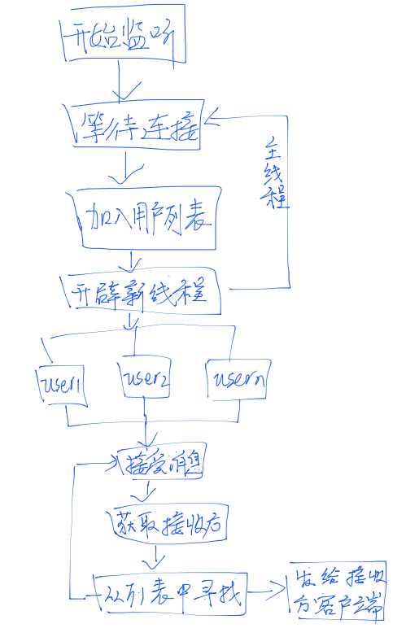
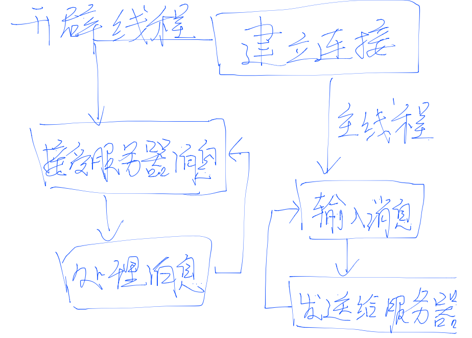

# 客户端-服务端-客户端的通信

因为并不是每个客户端都有公网IP，服务端作为中介让两个客户端直接建立连接的方式不可取。

所以我们采用**客户端-服务端-客户端**的通信方式，也就是一个客户端发送的消息还附带有他要发送的人的标识，服务端根据这个标识将这条消息转送到目的客户端上。

## 服务端逻辑



## 客户端逻辑



---

实现一个类似聊天室的程序比较容易，我决定先来做这个，代码加起来也就80+行。

*server.py*

```python
# -*- coding: utf-8 -*-
import time
import User
import socket
import threading

HOST = "127.0.0.1"
PORT = 23333

userlist = []

def hand_user_con(usr):
    while True:
        data = usr.skt.recv(1024).decode('utf-8')
        print(data)
        time.sleep(1)
        msg = data.split('|')
        if msg[0] == 'login':
            print('user [%s] login' % msg[1])
            usr.username = msg[1]
            usr.send_msg('Login Successfully')
        elif msg[0] == 'say':
            for user in userlist:
                if user != usr:
                    user.send_msg(usr.username + ' : ' + msg[1])
        elif msg[0] == 'exit':
            print('user [%s] exit' % usr.username)
            usr.logout()
            userlist.remove(usr)
            break

s = socket.socket(socket.AF_INET, socket.SOCK_STREAM)
s.bind((HOST, PORT)) 
s.listen(5) # 监听端口
print('Waiting for connection...')
while True:
    sock, addr = s.accept() # 接受一个新连接
    usr = User.User(sock)
    userlist.append(usr)
    t = threading.Thread(target=hand_user_con, args=(usr, )) # 创建新线程来处理TCP连接
    t.start()
s.close()
```

*User.py*

```python
# -*- coding: utf-8 -*-
import socket 

class User:
    def __init__(self, skt, username='none'):
        self.skt = skt
        self.username = username
    def send_msg(self, msg):
        self.skt.send(msg.encode('utf-8'))
    def logout(self):
        self.skt.close()
```

*client.py*

```python
# -*- coding: utf-8 -*-

import socket
import threading

HOST = "127.0.0.1"
PORT = 23333
nick_name = ""
is_normal = True

def recieve_msg(username, s):
    s.send(('login|%s' % username).encode('utf-8'))
    while True:
        data = s.recv(1024)
        print(data.decode('utf-8'))

username = input('Please input your name: ')
s = socket.socket(socket.AF_INET, socket.SOCK_STREAM)
s.connect((HOST, PORT))
t = threading.Thread(target=recieve_msg, args=(username, s))
t.start()

while True:
    msg = input()
    if not msg: continue;
    if msg == 'exit':
        s.send(b'exit')
        break
    s.send(('say|%s' % msg).encode('utf-8'))
```